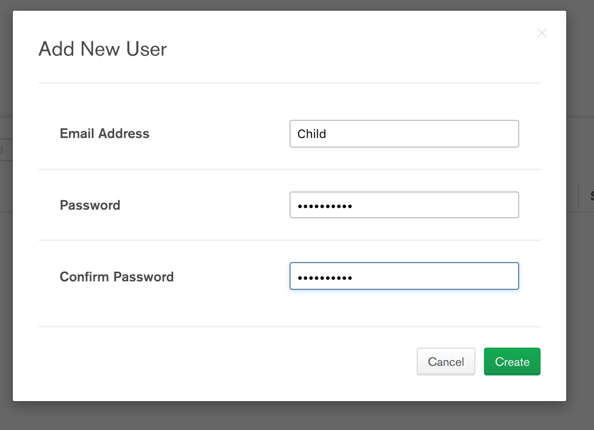
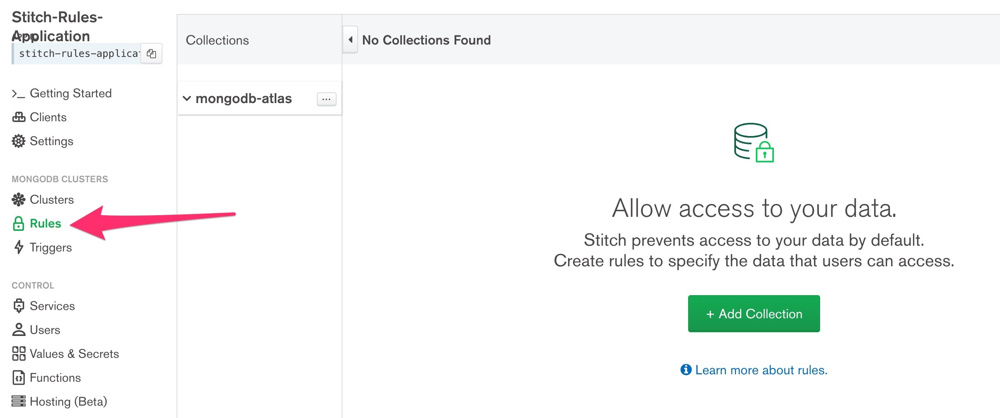
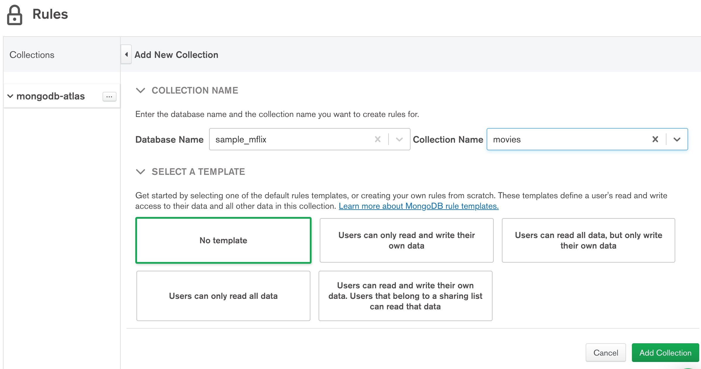

# [MongoDB World](https://www.mongodb.com/world) 2019 Builder's Fest
## Wednesday, June 19, 2019

### Controlling Access to Data using Rules with MongoDB Stitch
Have you ever supported an application with ever-changing data access rules?  In this session, users will be guided 
through hands-on exercises on how trivial data access can be with MongoDB Stitch.

This guide will serve as a step-by-step tutorial on how to control access to data
hosted in [MongoDB Atlas](https://www.mongodb.com/cloud/atlas) by incorporating the
use of [MongoDB Stitch](https://www.mongodb.com/cloud/stitch).

# Required Prerequisites
### MongoDB Atlas Account
In order to successfully complete this quick tutorial, the user should have the
following tasks completed:
* Complete [Getting Started with MongoDB Atlas](https://docs.atlas.mongodb.com/getting-started/).  This involves
creating an Atlas account, creating your first free tier cluster, and setting up
the appropriate security credentials.

* Load Sample data into your cluster by following the [Insert Data into Your Cluster](https://docs.atlas.mongodb.com/getting-started/#insert-data-into-your-cluster)
section of the Getting Started Guide.

* Ensure the *sample_mflix* database has been created and contains the *movies* collection.  This 
data can be easily verified within the MongoDB Atlas UI by using the [Data Explorer](https://docs.atlas.mongodb.com/data-explorer/index.html)
or connecting to your MongoDB Atlas cluster by using [MongoDB Compass](https://www.mongodb.com/products/compass).

### GitHub repo for source files and Node.js
After creating your Atlas cluster and loading the sample data, you are now ready to begin
interacting with it.  To complete the remainder of this tutorial, you will need to install the
following:

*  If you are familiar with *git*, you can simply:
```
git clone https://github.com/blainemincey/stitch-rules-mdbw2019.git
```

* In order to run the source files, you will need to ensure a recent version of Node.js and npm
are installed.  The web based application is constructed using React.  However, if you prefer
to interact with your Stitch Application in another way, the RulesTest.js script can be
used.  This will still require Node.js to be installed.

# Use Case Description
Our development team has developed a React-based Web application to display movies for a
particular persona.  Specifically, the web app should present movies appropriate for either
a Child, Teen, or Adult.  Typically, the team would control access to this data through a variety
of custom roles and/or permissions at the database level.  Their problem is that they have
already deployed the application to production and the person
responsible for performing these types of activities will be out of the office for 2 weeks!  Luckily, one of the developers
began researching MongoDB Stitch and the following is how they achieved their objective
without having admin rights to the MongoDB Atlas Cluster.

# MongoDB Stitch Tutorial
### Step 1 - Create Stitch Application
After completing the steps above, you can now create your Stitch Application.  First, click
the Stitch menu option in the left-hand navigation in the Atlas UI.  After clicking this, the
Create New Application button will appear in the center of the screen similar to the image
below.  Note: if you have already created a Stitch Application within this project, the Create Stitch
Application button will be in the top-right of the Atlas UI.

 

After clicking the button, you will be presented with the following dialog:

 

Enter a name for your application.  In this example, we name it *Stitch-Rules-Application*. Be
sure to keep the remainder of the defaults and be sure to be linked to your Cluster!  Now, click
the create button.

### Step 2 - Run the React Application
After creating our Stitch Application, let's now run our web based application. If you have
installed Node.js and npm, in the root of the repository that you cloned from git, run the
following command:
```
npm install
```
This will install the required components for the web application.  Now, when that has completed
building, open up *src/App.js* in your favorite editor.  Towards the top of the src file on 
line 9, you will find the following:
```
// Initialize Stitch.  Be sure to add your unique App Id!
let appId = '## Your Unique Stitch App Id ##';
```

What is your Unique Stitch App Id?  If you look in the upper left-hand corner of the Stitch
console, you will find your App Id.  Simply click the copy button as indicated in the image
below:

  

Once this App Id has been copied, paste over the existing value of the appId variable.
It should resemble something like the following:

```
// Initialize Stitch.  Be sure to add your unique App Id!
let appId = 'stitch-rules-application-oiwq';
```

Once you have saved App.js, you can now run the web application by running the following
command in the root directory within a terminal:
```
npm run start
```

If everything has been set up correctly, the application should begin running and your default
web browser should open up to http://localhost:3000/.

When the browser opens up and the components initialize, you should see something like the
following:


Go ahead and click on the Child, Teen, and Adult buttons.  Great, nothing works!  This is
where we will begin to employ the Rules capabilities of MongoDB Stitch!

### Step 3 - Create Stitch users for Child, Teen, and Adult
Since we have three types of users for our application, we will create 3 separate users or
personas.  To begin, we will need to enable an authentication provider.  Click the Users
link in the left-hand navigation and then click the Providers tab towards the top of the
screen that is opened.  It should be similar to that below:

  

Find the *Email/Password* provider and towards the right of that line, click the edit
button.  Be sure to move the Enabled slider to the right and then enter *https://www.mongodb.com*
in both the Email Confirmation URL and the Password Reset URL.  Then click Save.  This should
look similar to that below:

  

Once that has saved successfully, click the *Add New User* button at the upper right-hand
corner of the Stitch UI.  The following dialog should open:

  

We will create 3 separate users (we can omit an actual email address):
* Email Address: Child , Password: myPassword
* Email Address: Teen , Password: myPassword
* Email Address: Adult , Password: myPassword

Note: Yes, each user should absolutely have the same exact password for this example!

You Users view should resemble that below:

  

### Step 4 - Add the User Id to a Value
We will need to refer to the unique id value of each user.  Not the Name but rather the
long alphanumeric Id value. Let's grab the value of Child to begin.  This can be done from the 
*Users* screen that was indicated in the image directly above.  On the right-hand side
of the Child row, click the Ellipses button and select *Copy UID* as indicated below:

   

Now, click the left-hand navigation where it indicates *Values & Secrets*.  Then, click the
*Create New Value* in the center of the screen.

  

Next, we will create the *childId* value.  Enter a Value Name of *childId*.  Keep the
Plain Text radio button selected.  Now, we need to enter a value in the Value textbox.
It requires a String value wrapped in quotation marks.  Paste your copied UID of your 
Child user into this box.  It should look similar to that below and the click the Save 
button the lower right-hand corner of the screen.


Repeat the same exact process for *teenId* and *adultId*.  Once complete, we can refer
to our values within Rules, Functions, etc.

### Step 5 - Create our first rule
Click the *Rules* option in the left-hand navigation and then click the *Add Collection*
button in the middle of the screen.  It should look similar to that below:

  

Now, click the *Add Collection* button so we can begin modifying our rule and accessing our data.
In the Database Name, you should be able to select the *sample_mflix* option from the 
drop-down.  Then, select *movies* from the Collection Name dropdown.  Select *No template*
and then click the *Add Collection* button.  It should look like this below:



Finally, we have everything setup so we can begin accessing data for our 3 separate
user personas.  After adding the collection above, you will have the screen similar to
that below:

  

Click the *New Filter* button because we want to filter our movies based on the user or
persona type.  For our first filter, give it the Name of *childFilter*.  In the
*Apply When* textbox, paste the item below:
```
{
  "%%values.childId": "%%user.id"
}
```
Here, we are saying we want this filter applied when the Child user logs in.  For our Filter
Query, copy the code below:
```
{
  "rated": {
    "$in": [
      "TV-Y7",
      "G",
      "TV-G"
    ]
  }
}
```
It should be evident that when the child user logs in, we only want to display the movies
or TV shows with a child appropriate rating.  Your filter should look like that below:

  

Now, click the Save button in the upper right-hand corner.  If you are doing a "spot-check"
to see if anything has been returned yet, you would find...Nothing, Nada.  This is because
we have not provided any permissions to our data.  Click the *Permissions* tab and then
be sure to check the *Read* column for the *default* permission.  Follow the image below:

  

Now, click save and we should go to our web application and upon clicking the *Child* button,
we should be presented with Child-friendly movies and TV-Shows.  It should look somewhat
similar to the image below:

  

If you are curious, go ahead and click on the *Teen* and *Adult* buttons.  Yes, you will
get results but they will not be *filtered*.  We gave read permissions to our data for 
our default role.  However, we provided a filter specifically for a child.

Next, create the filter for the Teen and Adult users.  Remember, you will need to first 
create the Value for the Teen and Adult users first.  Then, you will create a filter for each
just like we did above for the Child user.  The *Apply When* will be almost the same
as the Child user except you will substitute the teenId and adultId Value Names.  The
Filter Query to use for each is below.

Filter Query for Teen:
```
{
  "rated": {
    "$in": [
      "PG",
      "PG-13",
      "TV-14",
      "TV-PG"
    ]
  }
}
```

Filter Query for Adult:
```
{
  "rated": {
    "$in": [
      "R",
      "TV-MA"
    ]
  }
}
```

#### Note: If you prefer to NOT use the web based application, you can use the RulesTest.js file that is provided.  Simply modify the *myAppId* value for your unique Stitch Application Id and you will also have to manually modify the *username* variable to Child, Teen, or Adult.

### Step 6 - Modify Permissions
What if you wanted to control the specific fields that are particular user persona has access
to?  Let's say that there are some movie posters that several parents believe are inappropriate
for their child to view even though the movies are acceptable.  Let's begin by modifying
the original *default* role and modify it for specifically the *Child* role.  Be sure you
are on the *Permissions* tab in the Rules screen.  Then, click the edit button for the
default role as indicated in the image below:

  

Rename the *default* role to *childRole*.  For the *Apply When*, use the same code that you
used for the *childFilter*.  Specifically, it is the following:
```
{
  "%%values.childId": "%%user.id"
}
```

Then, click Done Editing button on the bottom of the pop-up.

  

Now, you will need to add a field.  Click on the '+Add Field' button.  Add the field
value *poster*.  Be sure the 'Read' checkbox is NOT selected.  However, be sure that
the 'Add Additional Fields' button is selected.  It should be similar to that below when
you are complete with your edits.  Click the *Save* button in the upper-right hand side of
the Rules dialog.

  

By doing this, the Child persona will no longer display the poster field.  However, by
enforcing this level of permissions, you will find that no rows are displayed for
the Teen and Adult users.  Now, you will need to add both a teenRole and an adultRole
with the appropriate *Apply When* exactly as that above.  Simply use the 'Add Role' button
to add each additional role.

# Congratulations!  You have completed this tutorial!  Happy Coding!


